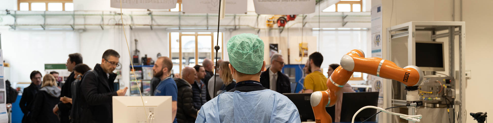

<!-- Banner -->

# NEARLab — Medical Robotics Section

**Developing innovative methods and solutions for clinical and surgical applications using Robotics
and Artificial Intelligence.**

_Medical Robotics and Computer-Aided Surgery Lab · [DEIB](https://www.deib.polimi.it/) ·
[Politecnico di Milano](https://www.polimi.it/)_

---

## 🔬 Research Areas

### 🖥️ Computer Vision & Predictive Medicine

Advanced computer vision and machine learning techniques to extract meaningful insights from medical
images and clinical data — enabling earlier diagnosis, more accurate predictions of disease
progression, and data-driven clinical decision-making.

### 🤖 Continuum Robotics

Design and control of continuum robotic systems. By leveraging flexible materials and advanced
modeling techniques, we develop robots capable of safe interaction, adaptability, and operation in
complex, unstructured environments.

### 🤝 Shared Autonomy in Robotics

Methods for enabling effective collaboration between humans and robots through shared autonomy.
Combining human input with intelligent control algorithms to enhance robot performance, usability,
and safety across a wide range of applications.

---

## 📦 Repositories

| Repo        | Description                                     |
| ----------- | ----------------------------------------------- |
| Datasets    | Open datasets released alongside publications   |
| Paper repos | Code repositories accompanying published papers |

---

## 📍 Find Us

NEARLab is located at:

- **Polimi - Campus Leonardo Robotics Labs** — Politecnico di Milano, piazza Leonardo da Vinci 32,
  Building 7, 20133 Milano
- **Campus Colombo** — Via Giuseppe Colombo 40, 20133 Milano

---

## 📬 Contact

[Contact us](https://nearlab.polimi.it/medical/contacts/) or visit the
[Research Areas](https://nearlab.polimi.it/medical/research) and reach out to the corresponding team
directly.
